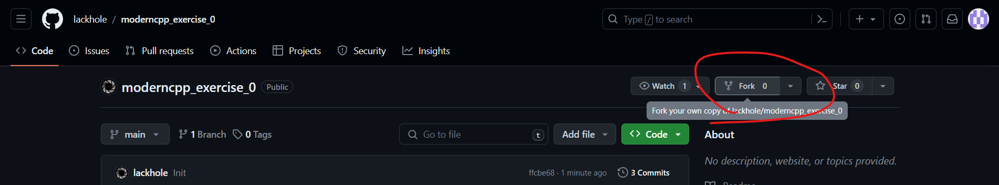
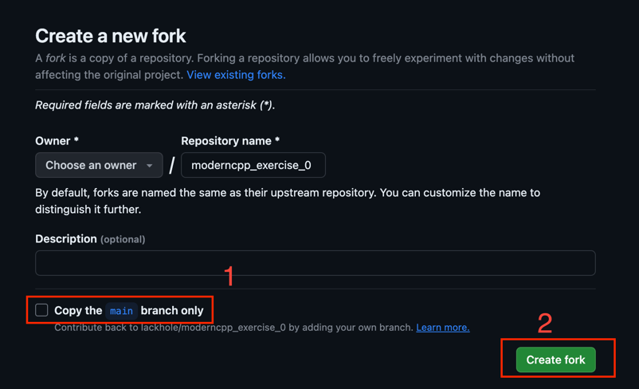
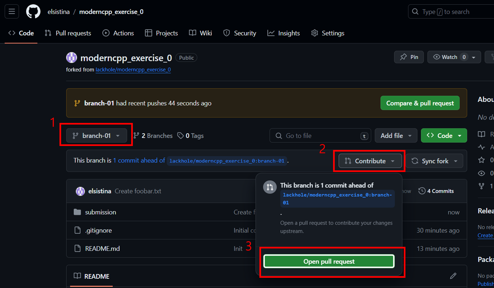

# moderncpp_exercise_0

## 1. 본 repository fork 하기
### 1-1

### 1-2

## 2. Fork 한 repository 를 clone 하기
### 2-1

### 2-2

## 3. `branch-01` 로 checkout 하기

## 4. `/submission` 폴더에 `<영어이름>.txt` 파일 생성 후 자신의 이름 쓰기
  * 예: `/submission/yonggyulee.txt`
## 5. 수정 내용 commit 하기

## 6. branch push 하기

## 7. GitHub.com 접속 후 내 repository 에서 contribute 클릭 하기

## 8. 원본 repository의 main` branch 에 PR 생성하기

